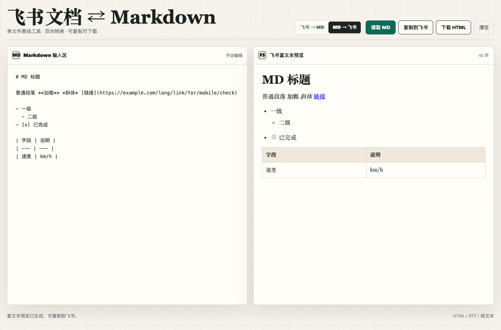

# 飞书文档 ⇄ Markdown 双向转换器

一个可以直接在浏览器里使用的单文件小工具：把飞书文档复制出来的富文本转换成 Markdown，也可以把 Markdown 转成可直接粘贴回飞书的富文本。



## 在线使用

打开 GitHub Pages 后即可使用：

> 发布后地址会是 `https://<your-github-name>.github.io/feishu-markdown-converter/`

也可以下载本仓库里的 `index.html`，双击用浏览器打开。工具完全前端运行，不需要安装依赖，不需要登录，也不会把内容上传到服务器。

## 适合谁

- 经常在飞书、语雀、Notion、GitHub、公众号草稿之间搬运文档的人
- 需要把飞书 PRD、会议纪要、方案文档沉淀成 Markdown 的产品/运营/研发
- 用 AI 写 Markdown 后，希望一键变成飞书可编辑富文本的人

## 核心功能

- **飞书 → Markdown**：从飞书复制带格式内容，粘贴到左侧，右侧自动生成 Markdown。
- **Markdown → 飞书**：输入 Markdown，生成富文本预览，点击「复制到飞书」后可直接粘贴进飞书文档。
- **纯离线**：所有转换都在浏览器本地完成。
- **单文件可分发**：一个 `index.html` 就能跑，发给别人也能用。
- **支持下载**：Markdown 可下载为 `.md`，富文本预览可下载为 HTML。

## 支持格式

飞书转 Markdown 支持：

- 标题：`h1` 到 `h6`
- 加粗、斜体、删除线、行内代码
- 链接、图片
- 有序列表、无序列表、嵌套列表、任务复选框
- 引用、代码块、分割线
- 表格

Markdown 转飞书支持：

- `#` 到 `######` 标题
- `**加粗**`、`*斜体*`、`~~删除线~~`、行内代码
- `[链接](https://example.com)`
- 无序列表、有序列表、嵌套列表、`- [x]` 任务项
- 引用、代码块、分割线
- Markdown 表格

## 使用方法

### 飞书转 Markdown

1. 在飞书文档里复制一段内容。
2. 打开本工具，选择「飞书 → MD」。
3. 粘贴到左侧。
4. 点击「复制 Markdown」或「下载 .md」。

### Markdown 转飞书

1. 选择「MD → 飞书」。
2. 把 Markdown 粘贴到左侧。
3. 右侧会生成富文本预览。
4. 点击「复制到飞书」。
5. 回到飞书文档直接粘贴。

## 隐私说明

工具是静态 HTML，没有后端服务。你的文档内容只在当前浏览器里处理，不会上传、不会保存、不会联网发送。

## 已知限制

- Markdown 本身不支持的样式，例如颜色、字号、批注、多人协作痕迹，会在转换时丢失。
- 不同浏览器对剪贴板权限限制不一样。如果「读取剪贴板」按钮不可用，直接手动粘贴到左侧即可。
- 飞书对粘贴 HTML 的兼容性可能随版本变化，复杂排版建议粘贴后再人工检查一次。

## 本地开发

这是一个零依赖项目，直接打开即可：

```bash
open index.html
```

## License

MIT
